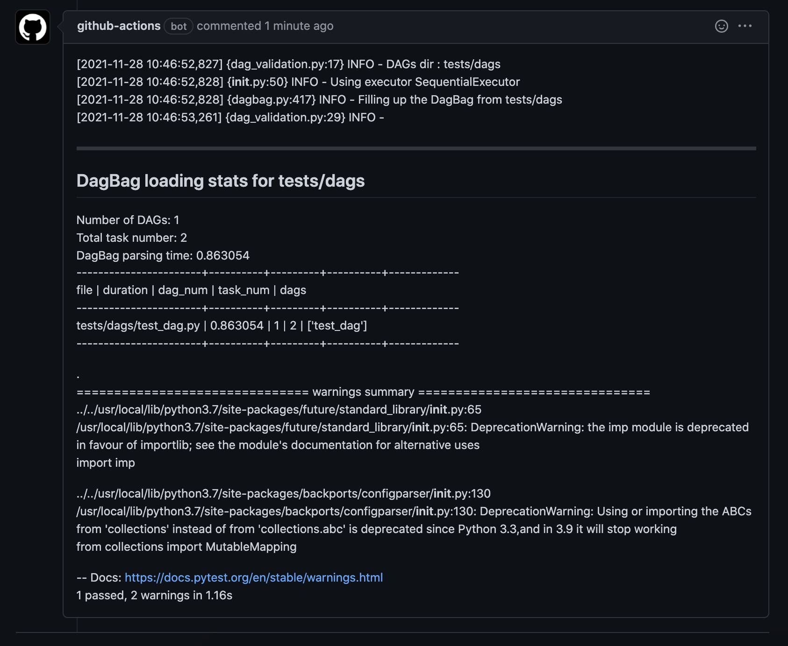

# Airflow-Dag-Validation-Action

Validate DAGs, Variables and Dependencies before deploying it to production by creating an isolated Airflow Environment on Docker Container with supplied variables and dependencies


### Examples of usage scenarios

Want to test airflow DAGs on folder tests/dags with a given plugins in tests/plugins, requirements file in tests/requirements.txt, airflow variable file tests/var.json, and airflow connection on file in tests/conns.json

- Provide your dependency files `requirements.txt` to test your python dependencies
- Your `var.json` to test your variables
- Your `conn.json` to test your connections
- path to your DAGs directory to test import your DAGs with supplied dependencies and variables
- path to your DAGS plugins directory to test DAGs using plugins
- And boolean flag for whether to load example dags or not

Workflows `.github/workflows/main.yml`

```yml
- name: 'Validate DAGs'
  uses: jayamanikharyono/airflow-dag-action@v2.3
  with:
    requirementsFile: tests/requirements.txt
    dagPaths: tests/dags
    varFile: tests/var.json
    connFile: tests/conns.json
    pluginPaths: tests/plugins
    loadExample: False
    accessToken: ${{ secrets.GITHUB_TOKEN }}
```

**Result**


### Todo

- Output Validation Result to PR comments ✅
- Upgrading to Airflow 2.0+ ✅
- Add Airflow Plugins Validation ✅
- Add Airflow Connections Validation ✅
- Output Detailed Validation Result for Plugins and Connections
- Possibility to have default Python version and Python version supplied by user/developer by Arguments/Env Variable

#### Contributions

Contributions are very welcome. You can follow this standard [contributions guidelines](https://github.com/firstcontributions/first-contributions) to contribute code.
