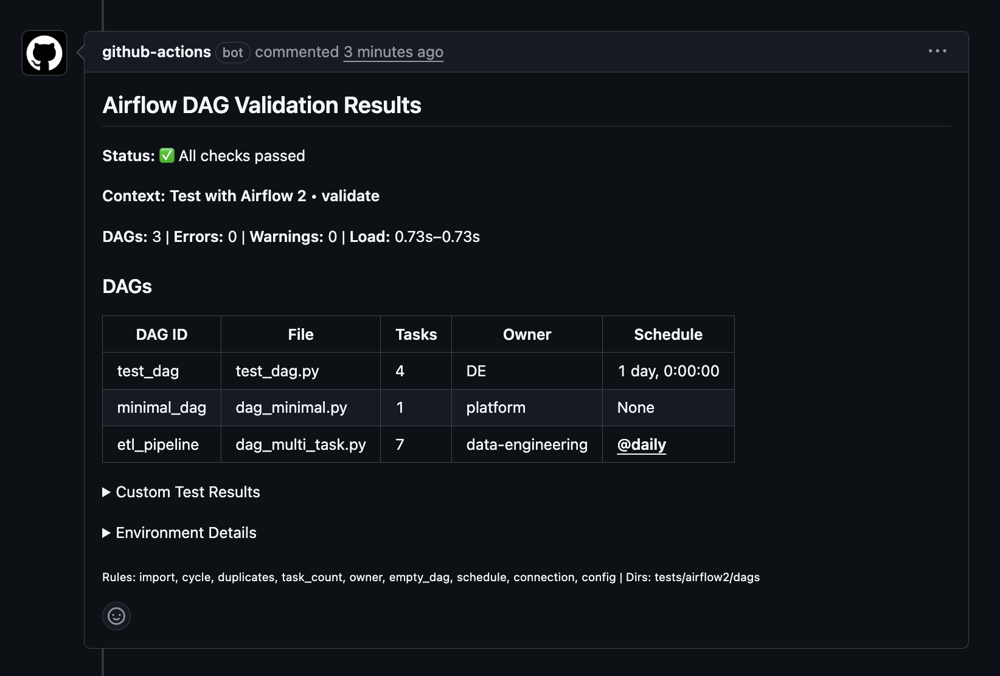
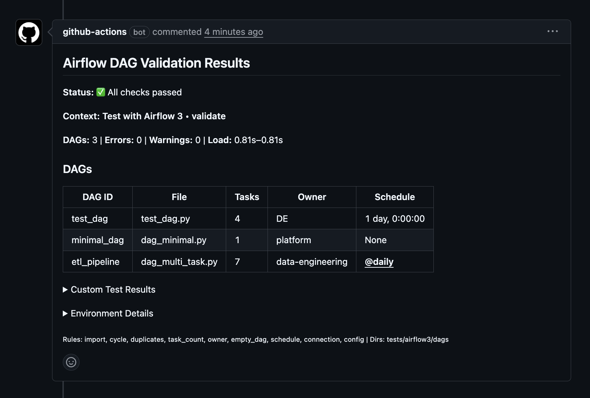

# Airflow-Dag-Validation-Action

Validate DAGs, Variables and Dependencies before deploying to production by creating an isolated Airflow Environment on Docker Container with supplied variables and dependencies.

Supports **Airflow 2.x** and **Airflow 3.x**.


## Examples of usage scenarios

Want to test Airflow DAGs in `tests/dags` with plugins in `tests/plugins`, requirements in `tests/requirements.txt`, variables in `tests/var.json`, and connections in `tests/conns.json`?

- Provide your **dependency files** (`requirements.txt`) to test your Python dependencies
- Your **`var.json`** to test your variables
- Your **`conns.json`** to test your connections
- **Path to your DAGs directory** to import and validate DAGs with supplied dependencies and variables
- **Path to your DAG plugins directory** to test DAGs using plugins
- **Boolean flag** for whether to load example DAGs or not

## Usage

### Airflow 2

```yml
- name: 'Validate DAGs'
  uses: jayamanikharyono/airflow-dag-action@v3
  with:
    dagPaths: dags
    pluginPaths: plugins
    requirementsFile: requirements.txt
    varFile: var.json
    connFile: conns.json
    accessToken: ${{ secrets.GITHUB_TOKEN }}
    airflowVersion: "2.10.4"
    airflowExtras: "async,postgres,cncf.kubernetes"
```

### Airflow 3

```yml
- name: 'Validate DAGs'
  uses: jayamanikharyono/airflow-dag-action@v3
  with:
    dagPaths: dags
    pluginPaths: plugins
    requirementsFile: requirements.txt
    varFile: var.json
    connFile: conns.json
    accessToken: ${{ secrets.GITHUB_TOKEN }}
    airflowVersion: "3.1.7"
    airflowExtras: "cncf.kubernetes"
    validationRules: "all"
    enableSarif: "true"
```

**Result**

**Airflow 2 Sample Comments**

**Airflow 3 Sample Comments**


## Inputs

| Input | Required | Default | Description |
|-------|----------|---------|-------------|
| `dagPaths` | No | `"dags"` | DAG directories to validate (comma-separated for multiple) |
| `pluginPaths` | No | `"plugins"` | Plugin directory |
| `requirementsFile` | No | `"requirements.txt"` | Path to pip requirements file |
| `varFile` | No | `""` | Path to Airflow variables JSON file |
| `connFile` | No | `""` | Path to Airflow connections JSON file |
| `loadExamples` | No | `"False"` | Whether to load example DAGs |
| `accessToken` | **Yes** | — | GitHub token for PR comments |
| `airflowVersion` | No | `"2.10.4"` | Apache Airflow version |
| `pythonVersion` | No | `"3.11"` | Python version for constraint resolution |
| `airflowExtras` | No | `"async,postgres"` | Comma-separated Airflow extras |
| `additionalPips` | No | `""` | Space-separated additional pip packages |
| `validationRules` | No | `"all"` | Rules to run: `import,cycle,duplicates,task_count,owner,empty_dag` or `"all"` |
| `maxTaskCount` | No | `""` | Max tasks per DAG before warning (empty = no limit) |
| `customTests` | No | `""` | Path to custom pytest validation file |
| `failOnError` | No | `"true"` | Set to `"false"` for warning-only mode |
| `enableSarif` | No | `"false"` | Generate SARIF output for code scanning |

## Outputs

| Output | Description |
|--------|-------------|
| `validator-result` | `pass` or `fail` |
| `sarif-file` | Path to SARIF file (when `enableSarif` is `"true"`) |

## Validation Rules

| Rule | Type | Description |
|------|------|-------------|
| `import` | Error | DAG fails to import (syntax errors, missing deps) |
| `cycle` | Error | Circular task dependencies |
| `duplicates` | Error | Multiple DAGs with the same `dag_id` |
| `task_count` | Warning | DAG exceeds `maxTaskCount` threshold |
| `owner` | Warning | Missing or default owner |
| `empty_dag` | Warning | DAG has zero tasks |

## Features

- Structured Markdown PR comments with DAG tables, errors, and warnings
- File-level GitHub Actions annotations on PR diffs
- SARIF output for GitHub Code Scanning integration
- Multiple DAG directory validation (comma-separated `dagPaths`)
- Custom pytest validation scripts
- Warning-only mode (`failOnError: "false"`)
- Pip dependency caching support
- Pre-built Docker images via GHCR
- Improved error classification — import errors are automatically categorized into sub-rules (`cycle`, `duplicates`, `connection`, `schedule`, `config`) based on exception patterns
- Load duration tracking in validation summary

## Structured PR Comments

PR comments are rendered from a Jinja2 template and include:

- Status badge (pass/fail) with workflow and job context
- DAG summary table (DAG ID, file, task count, owner, schedule)
- Error and warning tables with rule tags
- Collapsible full error details for long tracebacks
- Collapsible custom test results
- Collapsible environment details (variables, connections, plugins)
- Footer with applied rules and directories checked

## SARIF Integration

```yml
- name: 'Validate DAGs'
  id: validate
  uses: jayamanikharyono/airflow-dag-action@v3
  with:
    dagPaths: dags
    accessToken: ${{ secrets.GITHUB_TOKEN }}
    enableSarif: "true"

- name: Upload SARIF
  if: always() && steps.validate.outputs.sarif-file != ''
  uses: github/codeql-action/upload-sarif@v4
  with:
    sarif_file: validation_results.sarif
    category: airflow-dag-validation
```

## Pre-built Docker Images

Pre-built images are published to GHCR to speed up CI runs. The build matrix covers:

| Airflow Version | Python Version |
|-----------------|----------------|
| `2.10.4` | `3.11` / `3.12` |
| `3.1.7` | `3.11` / `3.12` |

## Breaking Changes (v3.0)

- The action no longer passes inputs as positional Docker `args`. All inputs are now read from environment variables (`INPUT_*`). This is transparent if you use the action via `uses:` as intended.
- The `validator-result` output value is now `"pass"` or `"fail"` (previously the raw output of the validation step).
- Minimum recommended Docker image is Python 3.11.

## Migration from v2.x

Add the new `airflowVersion` input to pin your Airflow version explicitly. The default is `"2.10.4"`, so existing Airflow 2 workflows will continue to work without changes.

```yml
- uses: jayamanikharyono/airflow-dag-action@v3
  with:
    dagPaths: dags
    accessToken: ${{ secrets.GITHUB_TOKEN }}
    airflowVersion: "2.10.4"        # explicit (was implicit in v2)
    airflowExtras: "async,postgres"  # new: control which extras are installed
    validationRules: "all"           # new: enable all validation rules
```

## Todo

- [x] Output Validation Result to PR comments
- [x] Upgrading to Airflow 2.0+
- [x] Add Airflow Plugins Validation
- [x] Add Airflow Connections Validation
- [x] Output Detailed Validation Result for Plugins and Connections
- [x] Possibility to have default and specified Python Version by user/developer via Arguments/Env Variable
- [x] Airflow 3.x support
- [x] Configurable Airflow version and provider extras
- [x] Modular validation rules engine (import, cycle, duplicates, task_count, owner, empty_dag)
- [x] SARIF output for GitHub Code Scanning integration
- [x] Structured PR comments with Jinja2 templates
- [x] File-level GitHub Actions annotations on PR diffs
- [x] Multiple DAG directory validation
- [x] Custom pytest validation scripts
- [x] Warning-only mode (`failOnError`)
- [x] Pre-built Docker images via GHCR
- [x] Pip dependency caching support

## Contributions

Contributions are very welcome. You can follow this standard [contributions guidelines](https://github.com/firstcontributions/first-contributions) to contribute code.
